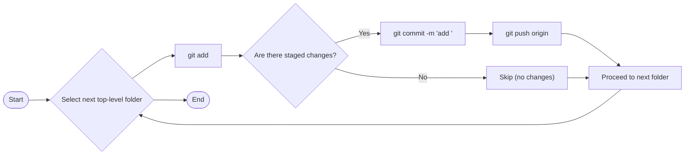

# Internship MERN Stack Practice

This repository contains daily practice projects and exercises for MERN-stack learning.

**Flowchart — Folder-by-folder push**



**How this was applied**

- Each top-level folder was committed separately so history shows when each folder was added.
- If a folder had no changes it was skipped.
- Pushes were made to the repository's `origin` remote and current branch.

**Quick manual commands**

To add and push a single folder locally:

```
git add path/to/folder
git commit -m "add folder: path/to/folder"
git push origin $(git rev-parse --abbrev-ref HEAD)
```

**Additional info**

- Repo root: top-level practice folders such as `01-June`, `02-June`, `2026-7-July`, etc.
- Ensure `origin` remote is configured and you have push access.
- If you want each folder as a separate GitHub repository, let me know and I can script repository creation.

